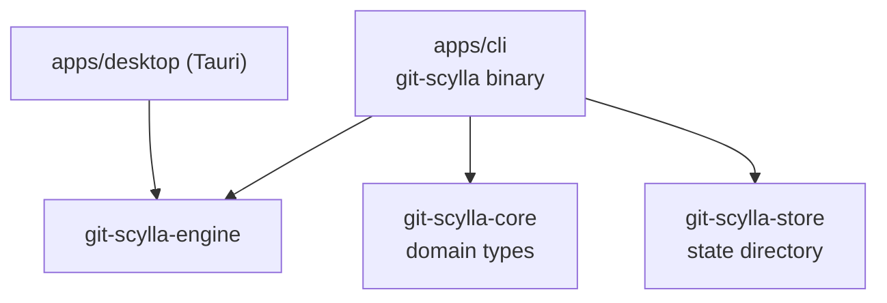
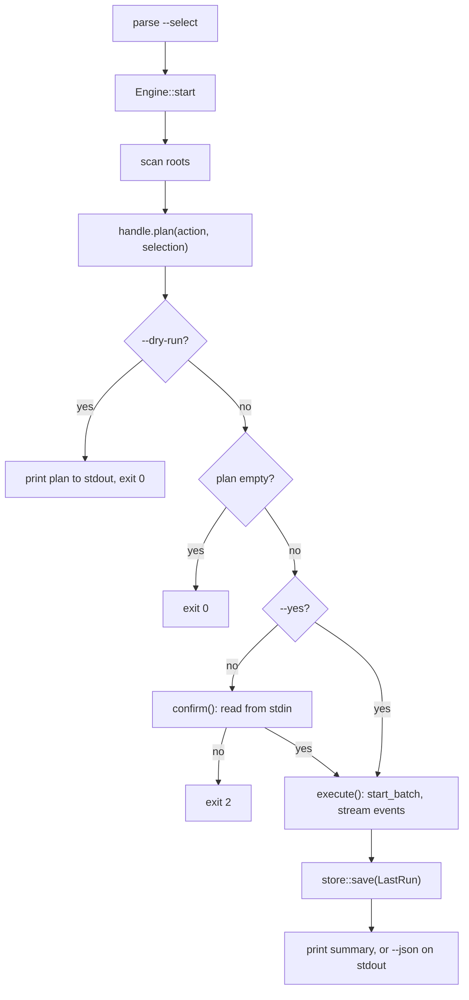
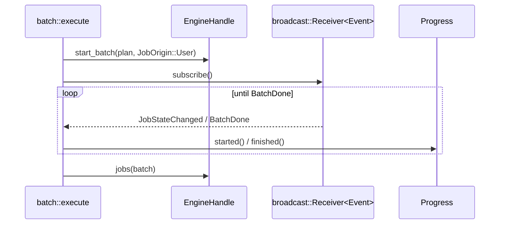
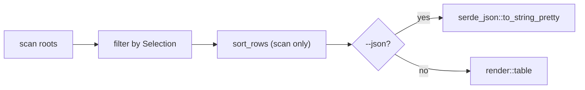
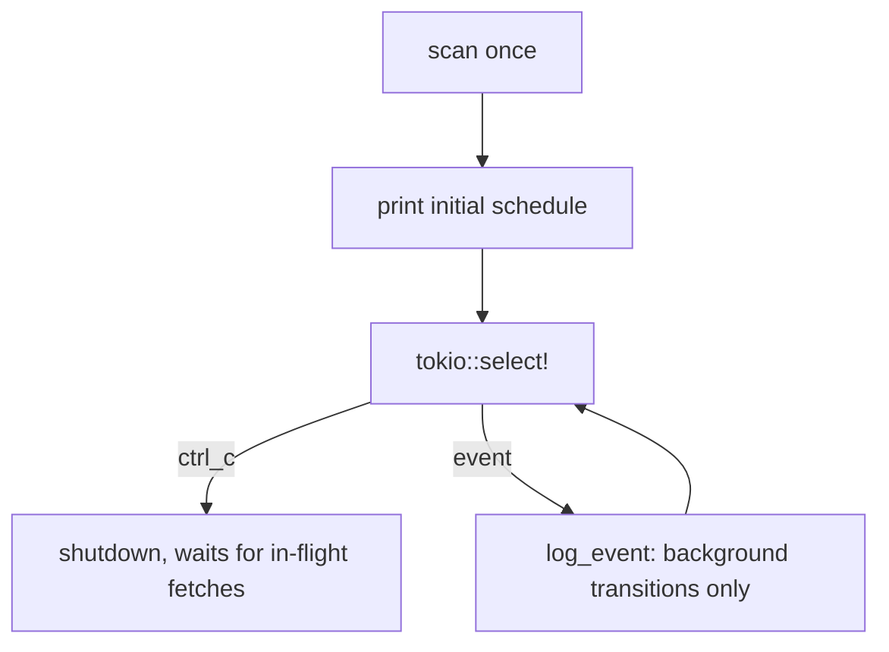

# git-scylla-cli

The terminal surface for git-scylla: parses arguments, drives
`git-scylla-engine`, and renders the result as a table, JSON, or a live
progress display.

The crate holds no domain logic. Eligibility, planning, scheduling, and
execution all live in the engine; this crate turns a command line into calls
against `EngineHandle` and turns the responses into text.

## Position in the workspace

`apps/desktop` is the other surface over the same engine. Neither knows the
other exists.

## Commands

`main.rs` declares one `clap` enum, `Command`, with one variant per verb.
Mutating verbs — `fetch`, `pull`, `run`, `stash`, `stash-pop`, `checkout`,
`branch`, `commit`, `push`, `sync-default`, `dev-tag` — share a `BatchArgs`
struct for roots, `--select`, `--dry-run`, `--yes`, `--json`, `--nested`, and
concurrency. `scan`, `status`, and `log` take their own arguments; none of
them mutates a repository.

`main` matches `Command` and calls into one of five modules:

| Module | Role |
| --- | --- |
| [`common`](../src/common.rs) | Selection parsing, scan invocation, concurrency limits, JSON output — shared by every verb |
| [`batch`](../src/batch.rs) | The mutating-verb pipeline: plan, confirm, execute, report |
| [`scan`](../src/scan.rs) | `git-scylla scan` |
| [`daemon`](../src/daemon.rs) | `git-scylla fetch --daemon` and `git-scylla status` |
| [`progress`](../src/progress.rs) | The live block of running repositories during a batch |
| [`render`](../src/render.rs) | Table formatting, colour, the `--help` legend |
| [`store`](../src/store.rs) | Reads and writes the last run's transcripts |

Every mutating `Action` is constructed in `main` from its `Command` variant
and passed to `batch::run`. The verbs differ only in which `Action` they
build; the pipeline that runs it is one function.

## The batch pipeline

`batch::run` is the same five steps for every mutating verb:

The plan is rendered to stderr before confirmation and to stdout for
`--dry-run`: stdout is reserved for `--json`, so the plan and the result
never share a stream with machine-readable output.

An empty plan and a `--dry-run` plan both exit `0` without asking anything.
Everything that can make a batch a no-op — an empty selection, a repository
already on the target branch — is a fact the plan already states.

### Confirmation

`confirm` reads one line from stdin unless `-y` is given. Three actions
demand different answers, encoded in `Accepts`:

| Guard | Prompt | Accepted answer |
| --- | --- | --- |
| none | `Proceed with N repositories? [y/N]` | `y` or `yes` |
| `ConfirmGuard::Acknowledge` | states what is irreversible | `yes` |
| `ConfirmGuard::TypeCount(n)` | states what is irreversible | the literal number `n` |

The engine attaches a guard to the `Plan`; the CLI only renders whichever one
it finds. A force-with-lease push carries `TypeCount`, so the answer cannot
be given without reading how many repositories are affected.

Confirmation is refused outright, not defaulted to no, when stdin is not a
terminal: a script that forgets `-y` gets a clear error rather than a batch
that silently did nothing.

### Executing a batch

A second task waits on `ctrl_c` and calls `cancel_batch` when it fires. The
process is never killed directly: a killed process leaves its `git` children,
and their `ssh` grandchildren, running past it.

## Reading the working set

`scan` and `status` never mutate. Both scan, filter by `Selection`, and print
— the difference is what they report.

`status` opens the engine with `CacheMode::Read`: it reads the fetch health
the daemon recorded without overwriting the cache with whatever roots were
passed on this invocation. `scan` uses the default cache mode and reports
every repository it finds, healthy or not; `status --stale-only` narrows to
repositories the fetch scheduler is unhappy with.

## The daemon

`fetch --daemon` runs the fetch scheduler in the foreground and logs every
decision as one line. It scans once, prints the initial schedule, then
selects between a `ctrl_c` future and the engine's event stream until
interrupted:

`log_event` filters to `JobOrigin::Background` and to state transitions worth
a line: a fetch starting or settling, a repository entering backoff or
quarantine. A user-initiated batch running at the same time produces its own
progress output and is not duplicated here.

## Progress display

`Progress` renders differently depending on whether stderr is a terminal.
On a TTY, finished repositories print as permanent lines and the still-running
ones redraw in place below them, capped at `MAX_BLOCK` names plus a count.
Off a TTY, only finished lines are printed, in order, with no redrawing —
append-only output that stays readable through `tee` or in a CI log.

Skipped jobs are not printed individually: the plan already grouped and
counted them, and one line per skip would bury the results that need reading
in a batch of any size.

## Persistence

`store.rs` writes `last-run.json` after every batch, holding the batch id,
the action, and every job with its full log. It is overwritten on each run,
not appended: `git-scylla log` answers "what happened to job 37 in the batch
that just finished," not a history across runs.

`git-scylla log` with no argument lists the jobs in the last run; with a job
id, it prints that job's full transcript, timestamped relative to the job's
own start.

## Testing

`tests/verbs.rs` and `tests/scan.rs` run the compiled binary (`CARGO_BIN_EXE_git-scylla`)
against local bare repositories, with an isolated `GIT_SCYLLA_STATE_DIR` per
test so no run reads another's transcripts. The suite needs no network:
every remote is a bare repository on the same filesystem.
