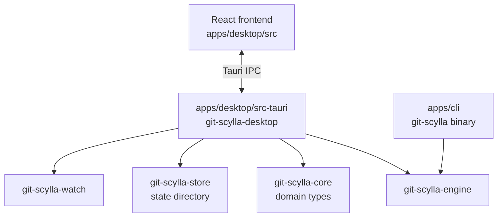
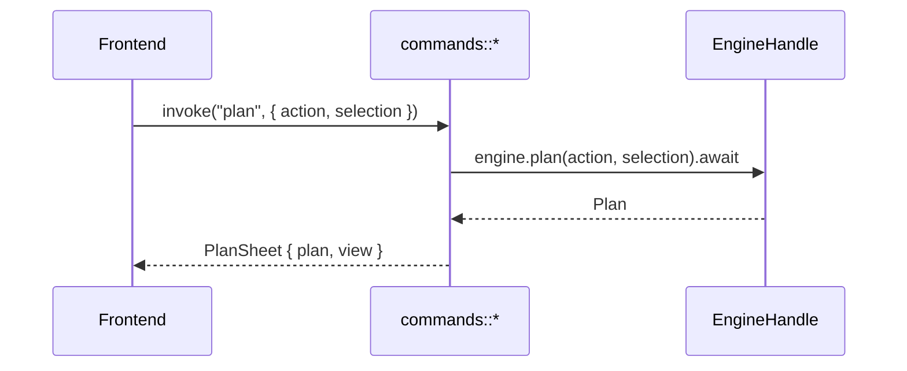
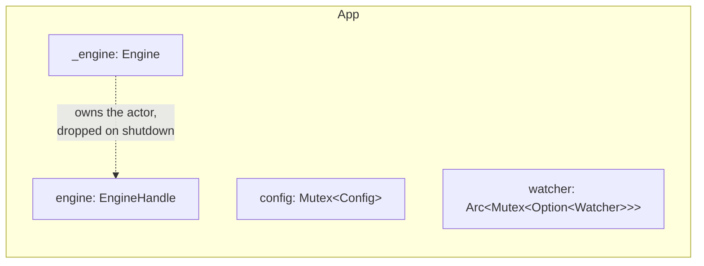
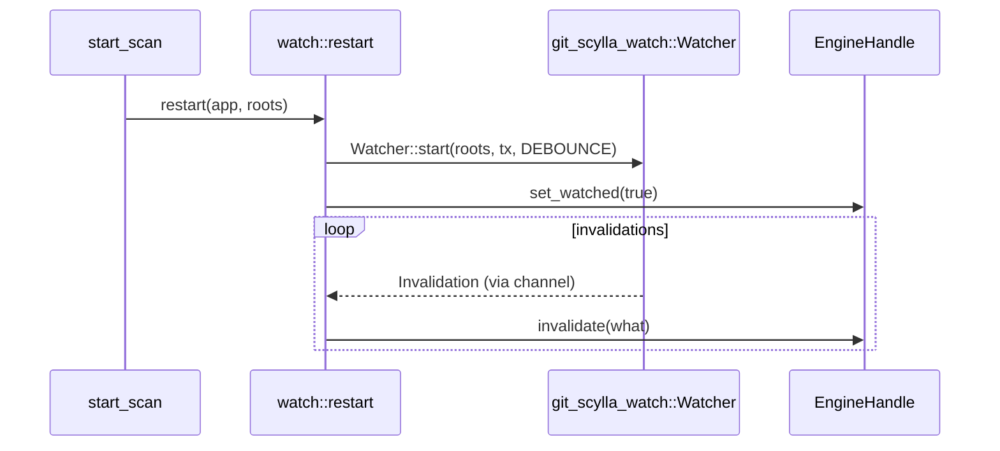
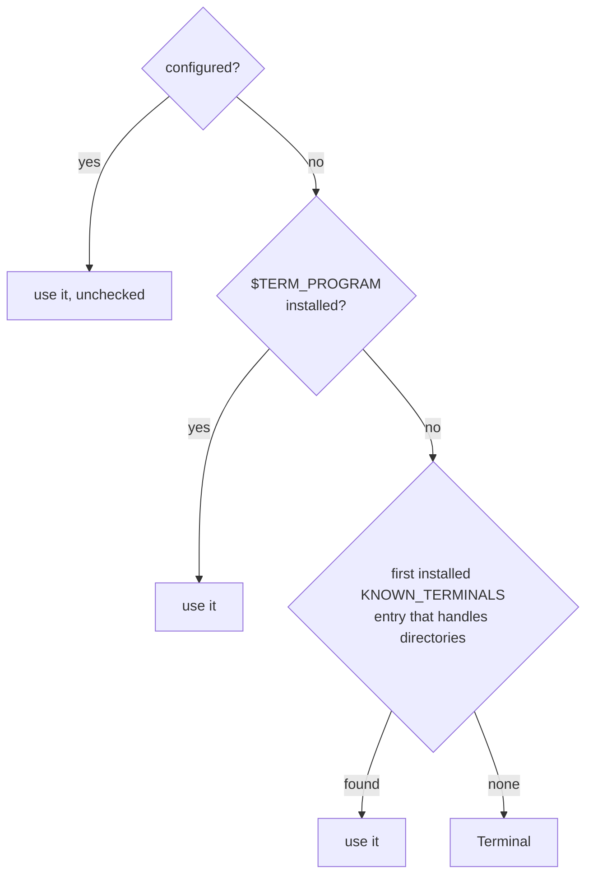

# git-scylla-desktop

The Tauri shell for git-scylla: a native window over `git-scylla-engine`,
talking to a React frontend through Tauri's IPC.

The crate holds no domain logic. Eligibility, planning, scheduling, and
execution all live in the engine; every command here sends a request and
awaits the reply. The exceptions are the things an engine has no business
knowing about — a native folder picker, a menu bar, opening a repository in
another application — which live here because there is nowhere else for them
to live.

## Position in the workspace



`apps/cli` is the other surface over the same engine. Neither knows the other
exists. `crates/store` resolves one state directory; the CLI and the desktop
app read and write separate files inside it (`last-run.json`, `config.json`).

## Modules

| Module | Owns |
| --- | --- |
| [`commands`](../src/commands.rs) | The Tauri command surface — one function per IPC call |
| [`state`](../src/state.rs) | `App`: the engine handle, the persisted config, the watcher slot |
| [`events`](../src/events.rs) | Forwarding engine events to the webview, batched |
| [`menu`](../src/menu.rs) | The native menu bar and its commands |
| [`watch`](../src/watch.rs) | Starting the filesystem watcher and keeping its index current |
| [`config`](../src/config.rs) | `Config`: roots, editor, terminal, custom commands — read and written to disk |
| [`row`](../src/row.rs) | `RepoRow`: a snapshot projected for the grid |
| [`handoff`](../src/handoff.rs) | Opening a repository in Finder, an editor, or a terminal |
| [`error`](../src/error.rs) | `BridgeError`: the shape every failed command takes on the wire |

## The command surface

Every `#[tauri::command]` function in `commands.rs` is registered once, in
`command_handler!` (`lib.rs`). The macro is used by both `run()` and the test
suite, so a command cannot be wired into the frontend without also being
exercised by `tests/bridge.rs`.



Most command bodies are one line: call the engine, map `Result` through `?`.
Three groups of commands are not passthroughs:

- **Roots and settings** (`get_config`, `add_root`, `remove_root`,
  `set_editor`, `set_terminal`, `put_custom`, `remove_custom`,
  `acknowledge_custom`) read and write `Config` through `App`. The engine has
  no concept of a configured working set; persisting one is this crate's job.
- **`pick_root_dir`** drives Tauri's native folder picker. It is not an engine
  operation — the engine has no business knowing about a dialog.
- **`hand_off`**, **`resolved_terminal`** open another application. Nothing
  interactive runs through the engine's job pipeline: no transcript, no undo,
  no plan sheet.

`PlanSheet` bundles a `Plan` with its rendered `PlanView` in one round trip.
The frontend hands the `Plan` straight back to `start_batch` unmodified — it
never edits what it confirmed.

## Errors

`BridgeError` is the only shape a failed command returns: a `kind` the
frontend branches on, and a `message` a person reads. A `Debug`-formatted Rust
error crosses the boundary in neither role.

## State



`App` is Tauri-managed state, built once in `run()`. `config` is a
`std::sync::Mutex`: nothing is held across an `.await`, so a blocking mutex is
enough. `watcher` starts `None` — there is nothing to watch before the first
scan — and is replaced wholesale on every `start_scan`, since `notify` has no
cheap way to change what it watches in place.

## Events

The engine publishes to a broadcast channel; `events::forward` subscribes once
at startup and re-emits to the webview on a 50 ms tick.

```mermaid
flowchart TD
    engine["EngineHandle::subscribe()"] --> recv{"select!"}
    recv -->|event| batch["push to batch"]
    recv -->|"50ms tick"| coalesce["coalesce(batch)"]
    coalesce --> project["map to UiEvent"]
    project --> emit["app.emit(\"engine://events\", payload)"]
    emit --> recv
    batch --> recv
```

`coalesce` collapses the two high-frequency event kinds — `ReposUpserted` and
`ScanProgress` — to their latest value per key within a tick; everything else
passes through in order. A `RecvError::Lagged` becomes an explicit
`Event::Lagged` in the stream rather than a silent gap.

`UiEvent` wraps `Event` and projects two variants instead of passing them
through: `Rows` carries `RepoRow` (the grid's `Badge` included, so the
frontend never derives one), and `BatchDone` carries the same rendered summary
line the CLI prints.

## The filesystem watcher

`watch.rs` owns two joins the engine and the watcher crate cannot make for
each other: telling the watcher which roots to watch, and telling the engine
whether a watcher currently covers them.



`follow_scans` runs for the life of the application, independent of any one
watcher: whenever a scan settles or a repository is removed, it re-reads the
engine's working set and rebuilds the watcher's index. A watcher that fails to
start is logged, not surfaced — the grid still works, driven by `Refresh`
instead of filesystem events — and the engine is told coverage is off, so it
falls back to judging snapshot age instead of trusting the watcher.

## Config and persistence

`Config` holds `roots`, `editor`, `terminal`, and named `custom` commands. It
serializes to `config.json` under the state directory `git-scylla-store`
resolves, written atomically.

- `add_root` rejects a root already covered by an existing one, and replaces
  any existing roots a new one contains.
- `put_custom` clears a command's `acknowledged` flag whenever its `args`
  change: the acknowledgement is scoped to one argv, not to the name.
- A missing or corrupt `config.json` loads as `Config::default()` rather than
  failing to start.

## Handoff

`handoff::hand_off` opens one repository in Finder, an editor, or a terminal —
through `tauri-plugin-opener`, the crate's only subprocess boundary outside
`crates/exec`.

Terminal resolution has an order:



`$TERM_PROGRAM` values naming an editor's integrated terminal (`vscode`,
`Hyper`, `JetBrains-JediTerm`) are excluded — handing a repository to one
would open the editor instead. "Handles directories" is decided by a substring
search for `public.directory` in the bundle's `Info.plist`, not a plist parse.
This resolution has no plan sheet to surface itself in, so `resolved_terminal`
exists purely to let the settings dialog show what it picked.

Editor resolution falls back to `$EDITOR` and reports `NotConfigured` if
nothing usable is set, rather than opening Finder — the system default for a
directory, and indistinguishable from a bug if it happened silently.

## The menu bar

`menu.rs` declares every menu command once, through the `menu_commands!`
macro: the `MenuCommand` enum, its id mapping in both directions, and the test
list are generated from a single table instead of kept in sync by hand. Every
item sends a `MenuCommand` event to the frontend and runs through the same
code path a click on the toolbar or grid would — there is no second route to
the engine from here.

Items that need a selection to mean anything start disabled and are toggled by
`set_has_selection`, called by the frontend on the empty↔non-empty transition.

## Testing

`tests/bridge.rs` drives the command surface through Tauri's mock runtime —
real IPC serialization, no window. It asserts that each command reaches the
engine and that its result crosses the boundary intact; what the engine
decides is the engine crate's own test suite.

One test, `the_cli_and_the_gui_plan_the_same_thing`, runs both surfaces over
one fixture and diffs the rendered plan: the CLI binary directly, and the
`plan` command through the mock IPC path. The two are asserted identical, not
merely each internally consistent.
