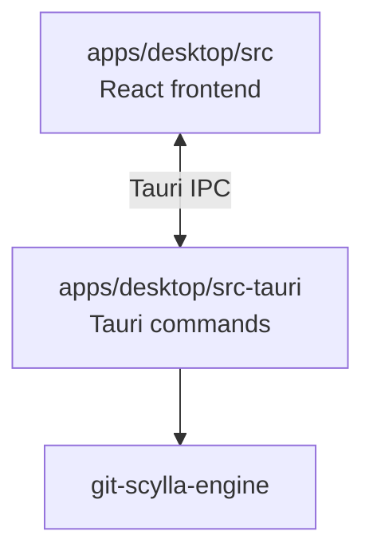
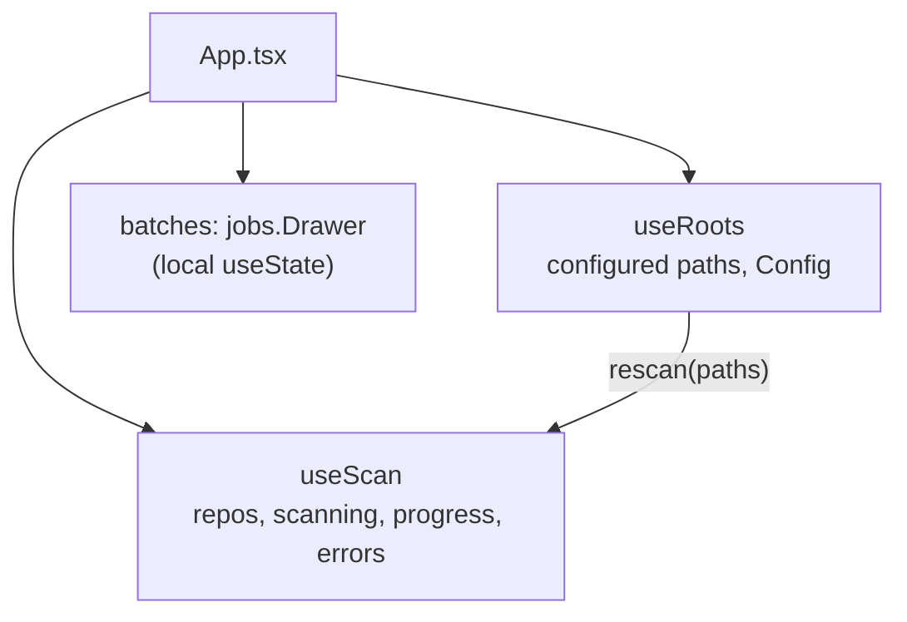
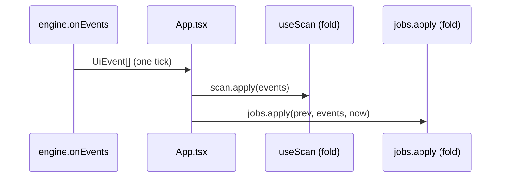
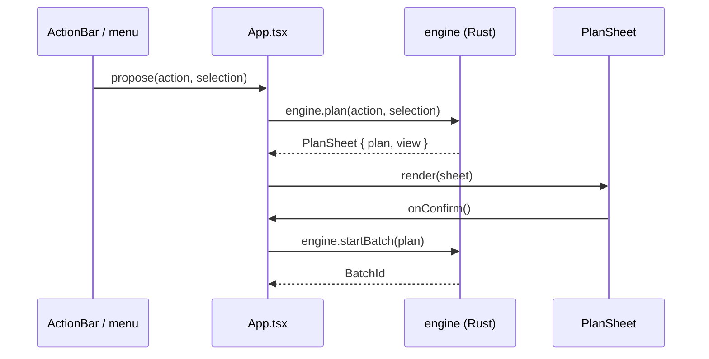
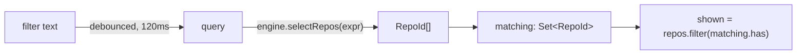

# apps/desktop/src

The React frontend for git-scylla's desktop app. A Tauri webview, not a
browser page: every mutation and every read of repository state crosses IPC
to `apps/desktop/src-tauri`, which forwards to `git-scylla-engine`. This
crate holds no domain logic — eligibility, planning, and execution all live
in the engine.

## Position in the workspace

`apps/cli` is the other surface over the same engine; this frontend does not
know it exists, and vice versa.

## Modules

| Module | Owns |
| --- | --- |
| [`App.tsx`](../App.tsx) | The shell: layout, selection, filtering, menu commands |
| [`engine/client.ts`](../engine/client.ts) | Every `invoke` and `listen` call, typed |
| [`bindings/`](../bindings) | Generated types, mirroring the Rust side |
| [`useScan.ts`](../useScan.ts) | Discovery: rows, scan progress, discovery errors |
| [`useRoots.ts`](../useRoots.ts) | Configured roots and the scan that follows a change to them |
| [`roots.ts`](../roots.ts) | Grouping repositories under their root, for the sidebar |
| [`jobs.ts`](../jobs.ts) | The drawer's state: batches and jobs, folded from events |
| [`guard.ts`](../guard.ts) | Whether a guarded plan may be confirmed yet |
| [`columns.ts`](../columns.ts) | Grid column ordering and sorting |
| [`Grid.tsx`](../Grid.tsx) | The repository table |
| [`ActionBar.tsx`](../ActionBar.tsx) | Buttons and menus that propose actions |
| [`Compose.tsx`](../Compose.tsx) | Small forms for actions that need input first |
| [`PlanSheet.tsx`](../PlanSheet.tsx) | The confirmation dialog |
| [`Drawer.tsx`](../Drawer.tsx) | Running and finished batches, and job transcripts |
| [`Settings.tsx`](../Settings.tsx) | Editor, terminal, and custom-command configuration |
| [`useDismiss.ts`](../useDismiss.ts) | Shared click-outside/Escape handling for popovers |

## Bindings

`bindings/` is generated from the Rust types by `scripts/bindings.sh` and
checked for drift in CI. `engine/client.ts` imports from it exclusively; no
type crossing the IPC boundary is redeclared by hand.

## State shape

`App.tsx` composes two hooks and holds the rest as plain `useState`:

`useScan` and `jobs.ts` each split into a pure fold and a thin hook. The fold
takes the current state and one tick of `UiEvent[]` and returns the next
state; the hook wraps it in `useState` and owns the one piece of I/O the fold
cannot do — re-reading a snapshot after a lagged channel.

A single listener in `App.tsx` receives every event tick and hands it to both
folds:

## The action flow

Every mutation goes through the same four steps. `Refresh` and `fetch_now`
are the only exceptions — neither changes repository state, so neither opens
a sheet.

`PlanSheet` renders no prose of its own. `headline`, `phrase`, `detail`, and
button labels all arrive from `PlanView`, composed in `crates/engine`. The
component decides layout only: modal, disclosure rows, which control holds
focus.

Undo reuses this same flow. `undoBatch` calls `engine.planUndo(batchId)`,
which returns a `PlanSheet` like any other action; confirming it calls
`engine.startUndo` instead of `engine.startBatch`.

## Selection and filtering

Selection is a `Set<RepoId>`, independent of sort order and of the filter.
Filtering narrows what `Grid` shows; it does not change what is selected.

The filter text is evaluated by the engine, not parsed here:

There is one grammar for selection expressions, in the engine; the CLI's
`--select` uses the same parser.

## Testing

Unit tests target the pure folds and functions — `useScan.test.ts`,
`jobs.test.ts`, `guard.test.ts` — and one component test, `Grid.test.tsx`,
covers keyboard and pointer selection. Component tests use
`@testing-library/react`; there is no end-to-end suite in this crate.
