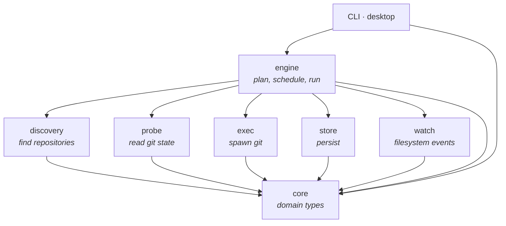
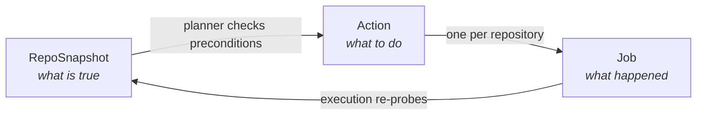
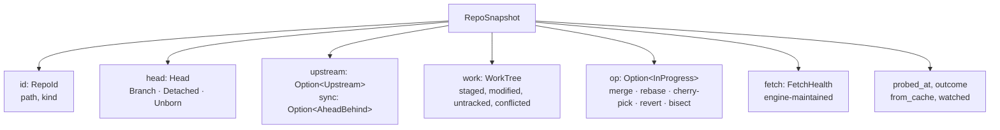
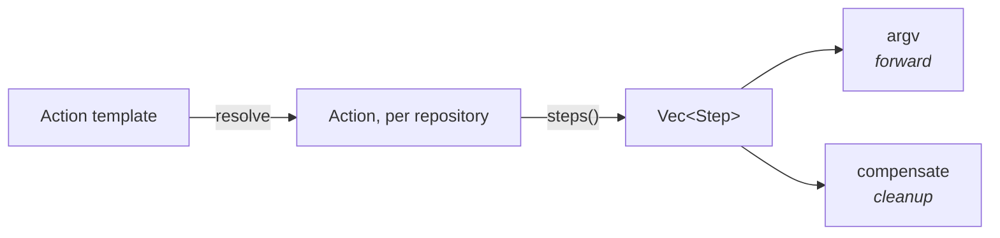
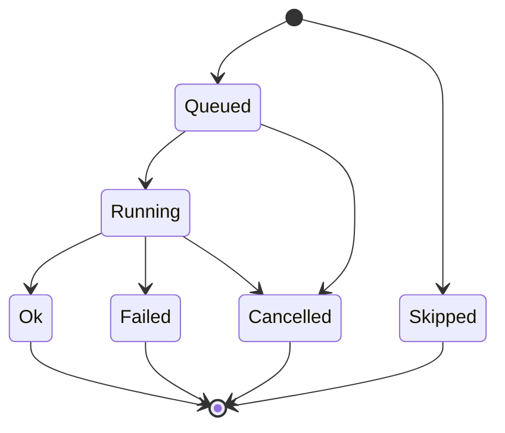
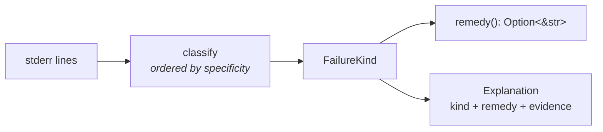
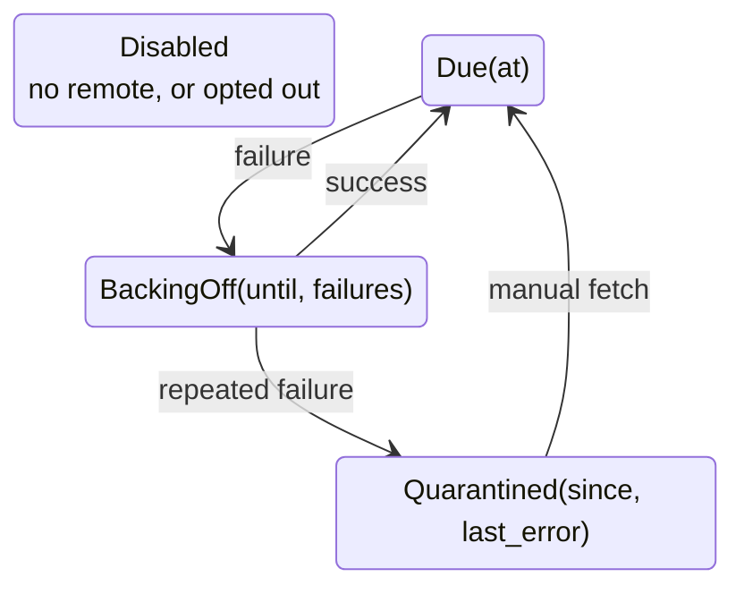

# `git-scylla-core`

The domain vocabulary of git-scylla. Every type describing a repository, an
action against one, or the result of running one lives here.

The crate is pure: no filesystem, no subprocesses, no clock-driven decisions.
Functions that need the time take `now: SystemTime` as an argument. Anything
that must read a disk belongs in `discovery` or `probe`; anything that must
schedule or wait belongs in `engine`.

## Position in the workspace



`core` depends on `serde` and `thiserror` and nothing else in the workspace.
Every other crate depends on it. Types cross crate boundaries as `core` types,
so a fact has one representation from the probe that read it to the surface that
renders it.

## Modules

| Module | Owns |
| --- | --- |
| `snapshot` | `RepoSnapshot` and the facts on it: `Head`, `Upstream`, `WorkTree`, `RepoKind`, `InProgress`, `ProbeOutcome` |
| `badge` | `Badge`, the one-value summary of a snapshot |
| `id` | `RepoId` (a canonical path) and `Oid` (a git object id) |
| `action` | `Action`, the argv it expands to, and its undo semantics |
| `job` | `Job`, `Batch`, `BatchSummary` — what an action turned into when run |
| `skip` | `SkipReason`, why a repository was left out |
| `log` | `LogLine` and `Stream`, the transcript |
| `explain` | Reading a failed transcript into a `FailureKind` and a remedy |
| `filter` | The selection-expression grammar |
| `fetch` | Auto-fetch bookkeeping and the fetch column's `FetchStatus` |
| `template` | Placeholder substitution for commit messages and branch names |
| `version` | Deriving the next tag in a pre-release series |
| `detail` | `RepoDetail`, per-repository data too expensive for the grid |
| `duration` | Phrasing durations: `3m`, `2h ago` |
| `serde_time` | `SystemTime` and `Duration` as Unix milliseconds |

## Three objects

Everything else supports three types.



### `RepoSnapshot` — what is true

Everything known about one repository at one instant. A struct of orthogonal
facts, not a state enum: a repository can be untracked-dirty, staged, three
ahead and seven behind at once.



Two nested `Option`s carry distinctions the rest of the tool relies on:

- `upstream: None` means no upstream is configured.
- `upstream: Some(u)` with `u.sync == None` means an upstream is configured and
  its remote-tracking ref is gone. This is not `ahead: 0, behind: 0`.

Trust is a first-class field. `is_trustworthy()` reports whether the probe
succeeded; `is_stale(now, max_age)` folds in age, cache origin, and watcher
coverage. A snapshot restored from cache is stale by construction — it carries
the previous run's `probed_at`. A watched repository is never stale.

Two derived values live here rather than in a surface, so the CLI and the
desktop grid cannot disagree:

- `badge()` → `Badge`, the worst-first summary. Declaration order **is** sort
  priority: `Conflict, InProgress, Diverged, Behind, Ahead, Dirty, Staged,
  Clean, Unknown`.
- `status_line()` → the counts column, `↑3 ↓7 ●2 +1 ?4`. No upstream renders as
  `-`; a gone tracking ref renders as `↑? ↓?`.

### `Action` — what to do

A closed enum, so preconditions and undo are decided exhaustively per variant.

```
Fetch  Pull  Push  Checkout  Commit  Stash  StashPop
Branch  Reset  SyncDefault  DevTag  Custom
```

An `Action` is resolved for **one** repository. Two variants carry an `Option`
that is `None` in a template and `Some` once the engine has answered it for a
given repository:

- `SyncDefault { plan: Option<SyncPlan> }` — this repository's default branch,
  the branch to return to, and whether to stash first.
- `DevTag { name: Option<String> }` — the tag name derived from this
  repository's own tags.

An unresolved action expands to zero steps.

`Action::steps()` is the only place in the project where a git argv for an
action is constructed. The `argv_discipline` test enforces the matching rule for
spawn sites: `GitCommand::new` appears in three registered files and nowhere
else. The argv a plan sheet shows, the argv a transcript records, and the argv a
process runs are the same strings.



A `Step` pairs an argv with an optional `compensate` argv. Compensations run
after the forward pass **whether the job succeeded or failed**, in reverse order
over the steps that completed. `SyncDefault` is the shape that needs it:

| Pass | Command |
| --- | --- |
| Forward | `git stash push` |
| Forward | `git checkout <default>` |
| Forward | `git pull …` |
| Cleanup | `git checkout <back_to>` |
| Cleanup | `git stash pop` |

Compensation is not undo. Compensation closes what a step opened; undo repairs
a job that succeeded and should not have.

Three predicates classify every action:

- `is_network()` — takes the network semaphore. `Fetch`, `Pull`, `Push`,
  `SyncDefault` always; `DevTag` when it publishes; `Custom` per its own flag.
- `is_mutating()` — can move `HEAD` or create local history, so `head_before` is
  worth recording. `Fetch` is the only built-in action that is not.
- `undoability()` → `Undoable::Reset(mode)`, `Undoable::Switch`, or
  `Undoable::No(reason)`. A `Checkout` is undone by switching, never by
  resetting: on a branch, `reset --hard` moves that branch's pointer.

### `Job` — what happened

One action against one repository. A `Batch` is one user gesture: the template,
the origin, and the job ids it produced.



`is_terminal()` and `ran()` answer different questions. `Skipped` is terminal
but never touched the repository, which is what makes 31 done and 13 skipped a
successful run rather than a partial failure.

A job carries the fields undo needs: `head_before`, `head_after`, and
`branch_before`. `head_after` is what makes undo safe — a repository whose
`HEAD` differs from `head_after` has been committed on top of, and moving it
back would discard work nobody offered up.

The transcript is one ordered `Vec<LogLine>` on the job. Each `StepRun` holds a
`Range<usize>` into it, so output stays attributable per step while the
interleaving of stdout and stderr is preserved. `Job::step_log` clamps the range
rather than panicking.

`BatchSummary` is a tally, not a verdict. `is_clean_sweep()` is the only
predicate offered; there is no `succeeded()`. `render()` produces the one
sentence both surfaces show: `31 ok, 3 failed, 13 skipped in 4.2s`.

## Skips and failures

Two closed vocabularies, for the two ways a repository comes out of a batch
without a green result.

- `SkipReason` — the job never ran. Every variant phrases a cause the user can
  act on: `"no upstream configured"`, not `"skipped"`. Rendered lowercase, no
  trailing punctuation, fits a table cell.
- `FailureKind` — the job ran and git refused. Derived from the transcript by
  `explain()`, never stored on the job: an interpretation improves while git's
  words stay the same.



`classify` matches on English. The hardened execution environment sets
`LC_ALL=C`. Specificity ordering matters: `stale info` is checked before
`[rejected]`, because a stale lease also prints `[rejected]` and the remedies
differ. `Explanation` always carries the line it was read off, so a user who
disagrees with the interpretation can see its source.

Every `FailureKind` variant has a distinct remedy. A kind that would be
explained the same way as another is not a kind.

## Fetch state

`FetchHealth` rides on the snapshot as engine-maintained state. `FetchSchedule`
is the machine; `FetchStatus` is what the fetch column says.



`snapshot.fetch_status()` collapses this into six cases: `NoRemote`, `Off`,
`Quarantined`, `BackingOff`, `Fetched { at }`, `Never`. `is_problem()` is true
only for the two the user can act on.

`Fetched { at }` reports the newest fetch by anyone — `Upstream::last_fetch`,
the mtime of `FETCH_HEAD` — falling back to this tool's own
`FetchHealth::last_success`. The `behind` count is exactly as current as that
timestamp.

## Filter grammar

One parser, shared by the CLI's `--filter` and the desktop filter box.

```text
expr   := term ('&' term)*
term   := '!'? (key ':' value | badge)
key    := badge | branch | name | path | kind | upstream | op
        | ahead | behind | staged | modified | untracked | conflicted | stashes
value  := glob | keyword | comparison
cmp    := ('>' | '>=' | '<' | '<=' | '=')? number
glob   := literal with '*' (any run) and '?' (any one)
```

No `|`, no parentheses, no precedence. Every term must match. A bare word is
accepted only as a badge, so `dirty` works; any other bare word is an error
rather than a term that silently matches nothing.

A `Filter` keeps its source text and serializes as that text. Deserializing
re-parses, so a malformed expression cannot cross a boundary and become a filter
that matches nothing. Evaluation is a pure function over a `RepoSnapshot`.

Globs are exact matches, not substring matches: `branch:main` does not select
`maintenance`. Matching is iterative with backtracking.

`ahead:` and `behind:` return false for a repository with no upstream or a gone
tracking ref, rather than treating the position as zero.

## Templates and versions

`template::render` substitutes a closed set — `{repo}`, `{branch}`, `{date}` —
and leaves anything else exactly as written. `PLACEHOLDERS` is exported as data
so help text does not restate the table. Dates are UTC, computed in-crate.

`version::next_dev_tag(tags, channel, bump)` derives the next name in a
pre-release series from tag names alone. Ordering is by parsed version, never by
commit date.

1. The newest release — a tag with no pre-release part — bumped by `bump`.
2. The newest tag already in this channel.
3. The higher of the two is the target version; the counter is one past the
   highest already used at that version.

Unparseable tags and pre-releases in other shapes (`-beta`, `-rc1`) are ignored.
The `v` prefix follows whichever tag decided the answer. A repository with no
tags gets the first tag in the series.

## Wire format

Timestamps serialize as signed Unix milliseconds and durations as whole
milliseconds, via `serde_time`. serde's own `{secs, nanos}` map is unpleasant
from `jq` and worse from generated TypeScript. A round-trip truncates to the
millisecond: idempotent, not an identity.

Enums use adjacent tagging — `{"type": …, "value": …}` — because internal
tagging cannot represent a newtype variant wrapping a string. Enums whose
variants are all unit-valued keep serde's plain-string form.

## Features

| Feature | Effect |
| --- | --- |
| `ts` | Derives `ts_rs::TS` and exports TypeScript definitions. Off by default; a build-time concern for one consumer. |
| `testkit` | Enables `RepoSnapshot::stub`. Off by default, so a shipped binary cannot construct an invented snapshot. On in the dev-dependencies of crates that test against one. |

`RepoSnapshot::stub` gives a clean repository on `main` tracking nothing, with
`probed_at` at the epoch. Override what a test is about and leave the rest.
