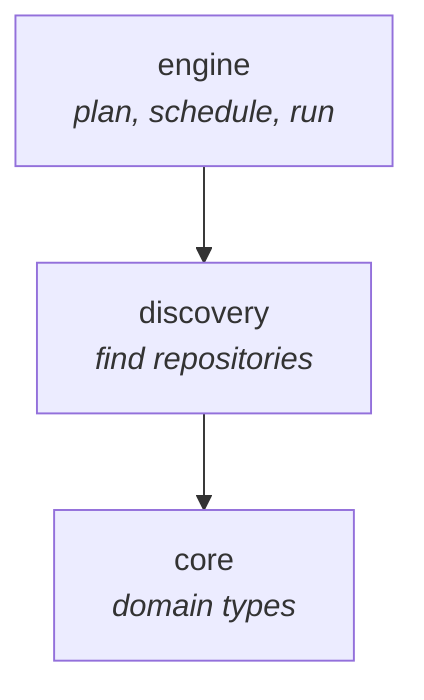
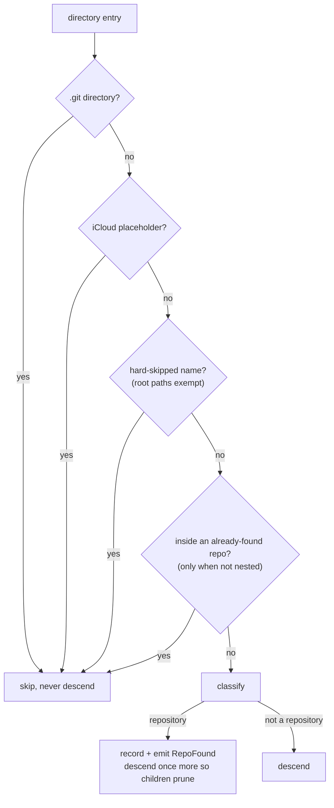
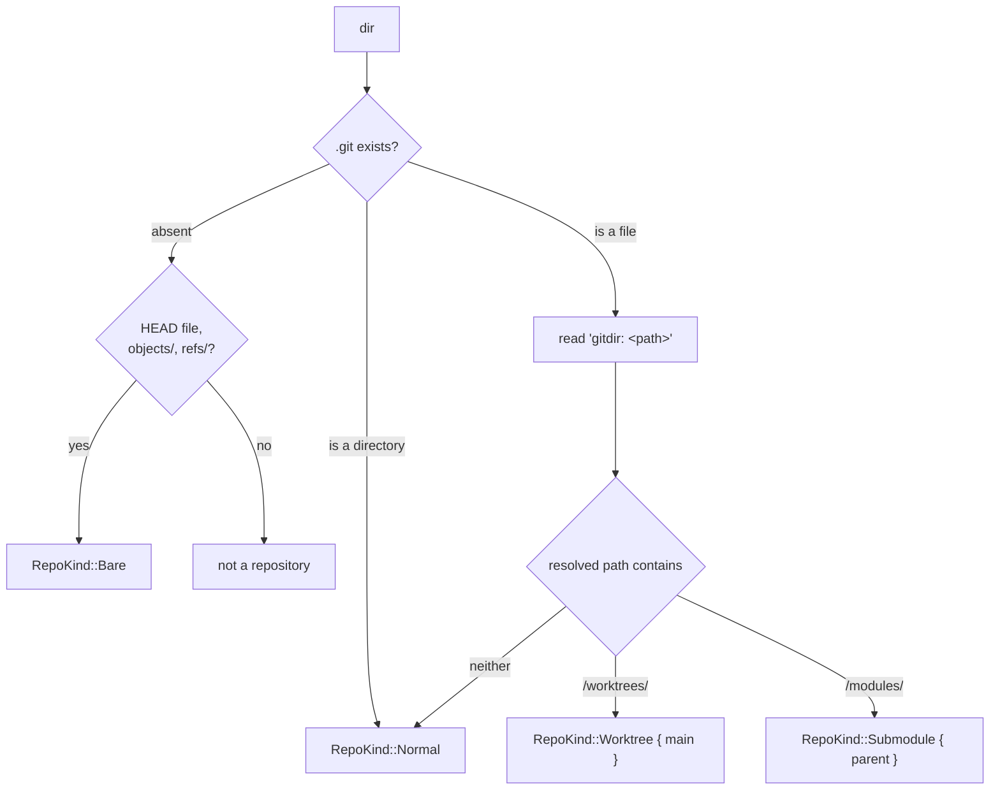

# `git-scylla-discovery`

Finds git repositories under a set of root directories.

A raw filesystem walk, not gitignore semantics: the target is frequently
inside a directory a `.gitignore` would exclude. The crate does not read git
state — it only locates repositories and classifies their kind. Reading state
belongs to `probe`.

## Position in the workspace



`discovery` depends on `core` for `RepoId` and `RepoKind`, and on `ignore` for
traversal. It has no dependency on `probe`, `exec`, or `store`.

## Modules

| Module | Owns |
| --- | --- |
| `skip` | Directory-level exclusion: the hard-coded name list, the `.git`-directory test, the iCloud placeholder test |
| `walk` | `Walker`, `WalkOptions`, `RepoFound`, `DiscoveryError`, and repository classification |

## Walking

```
Walker::new(roots).options(opts).walk(tx) -> (count, Vec<DiscoveryError>)
```

Results stream through an `UnboundedSender<RepoFound>` as they are found,
rather than collecting into a `Vec` first. `walk` is blocking and runs the
traversal on the calling thread.

Roots are canonicalized and deduplicated before the walk starts. A root that
does not resolve becomes a `DiscoveryError::UnusableRoot`; the walk continues
over whichever roots remain usable.

Each root is classified in a pre-pass, separately from the traversal below it.
`ignore::WalkBuilder` never calls `filter_entry` for a depth-0 entry, so a root
that is itself a repository has to be classified explicitly or it is never
seen.



Traversal is single-threaded and depth-first, so a directory is always
classified before its children are visited, and the prune decision for a
child never races the classification of its parent. `--nested` controls
whether a repository's own subtree is descended into looking for further
repositories.

## Classification



A `.git` file holds `gitdir: <path>`, relative for a submodule and absolute
for a linked worktree. The owning repository is the parent of whichever
`.git` directory that resolved path runs through. If the owner cannot be
resolved to a `RepoId`, the entry falls back to `RepoKind::Normal` rather than
being dropped.

A `.git` directory is never itself classified, bare or otherwise, and is
never descended into.

## Skips

`HARD_SKIP_NAMES` (`skip.rs`) lists directory names never descended into:
dependency and build trees (`node_modules`, `target`, `.build`, `Pods`,
caches), and the macOS system trees (`Library`, `System`, `Volumes`, `.Trash`).
`System`, `Library`, and `Volumes` only match at the filesystem locations
macOS actually puts them — a project directory named `System` is not skipped.

A path passed explicitly as a root is exempt from the name-based skip list,
so `git-scylla scan /Volumes/work` still works.

`looks_dataless` detects an iCloud Drive placeholder by its `.icloud` naming
convention. Statting the entry to check more precisely would itself trigger
the download the check exists to avoid.

## Errors

```rust
enum DiscoveryError {
    UnusableRoot(PathBuf),
    Unreadable { path: PathBuf, reason: String },
    MoreUnreadable(usize),
}
```

An unreadable directory inside a root does not abort the walk; it is
collected and returned alongside the count. The first 20 are reported
individually; beyond that, `MoreUnreadable` reports only a remaining count.

## Cancellation

`Walker::cancel_flag()` returns an `Arc<AtomicBool>` checked once per
directory entry inside the traversal filter. Setting it abandons the walk at
the next entry.

## Identity

`RepoFound::id` is built with `RepoId::from_canonical`, skipping a second
canonicalize syscall. This is sound because every path the walk emits is
already canonical: roots are canonicalized up front and `follow_links(false)`
means no path component below them is ever a symlink.

## Testing

`tests/fixtures.rs` walks the shared fixture set from `git-scylla-testkit`
and asserts the exact set of discoverable paths and their kinds, with and
without `--nested`. Unit tests in `skip.rs` and `walk.rs` cover individual
predicates and walk behavior (pruning, cancellation, unreadable directories,
symlink loops) against ad hoc temporary directories.
