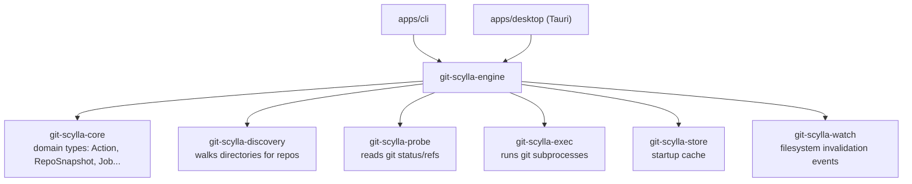
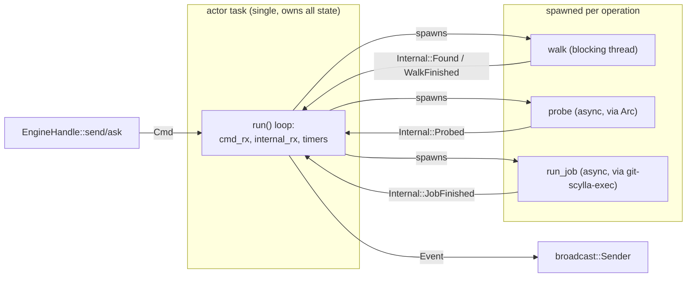
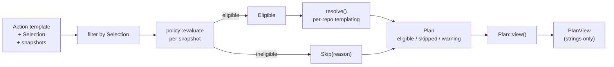
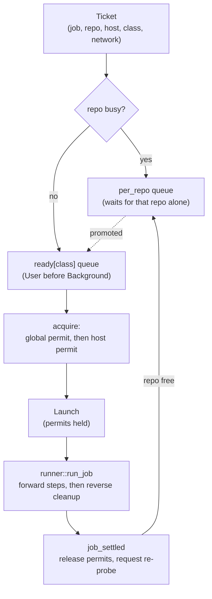
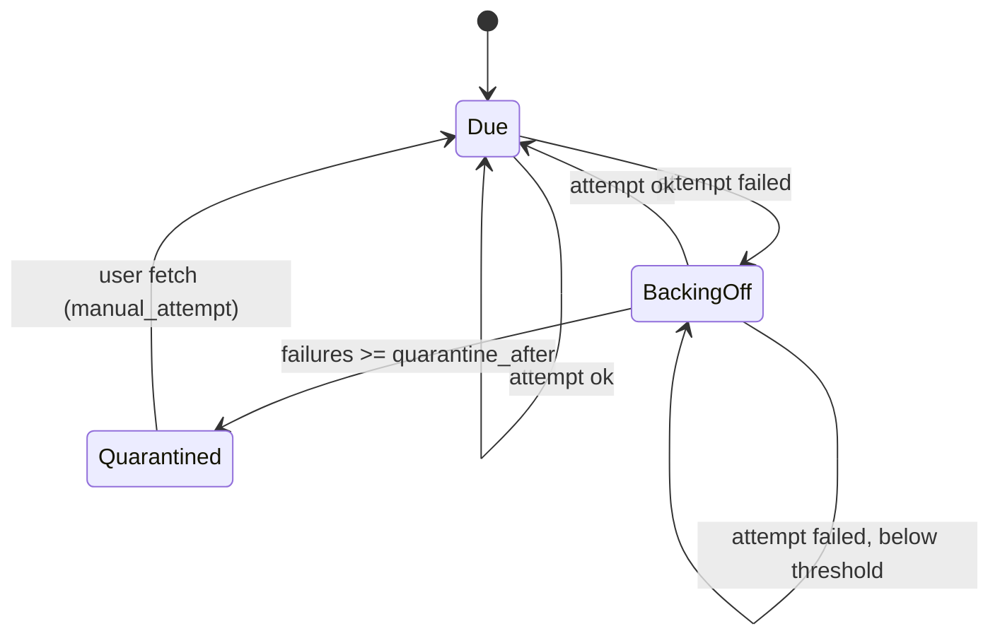

# git-scylla-engine

The action engine for git-scylla: policy, planning, scheduling, and job execution
for operating on many git repositories at once.

The CLI and the desktop shell are both thin surfaces over this crate. Neither
Tauri nor a terminal is visible from here.

## Position in the workspace

`engine` depends on every other domain crate. Nothing depends on `engine`.

## The actor

One `tokio::task` owns every mutable map: repository snapshots, jobs,
batches, scans, the scheduler, probe bookkeeping. A walker, a probe pool, a
job scheduler, a watcher, and a fetch tick all write into that state.

`EngineHandle` is the public interface. It sends `Cmd` over an `mpsc`
channel and exposes a `broadcast::Receiver<Event>`. Both are cheap to clone;
the CLI and every GUI window hold their own handle.

`Engine::start` spawns the actor and returns a handle. `Engine::shutdown`
stops it and waits for in-flight jobs to finish.

### Task boundaries

The actor loop itself never blocks. Anything that touches disk or a
subprocess runs on a separate task and reports back through one internal
`mpsc` channel, which the actor loop drains alongside `Cmd`.

Cancelling a scan sets an `AtomicBool` the walker checks. Cancelling a batch
cancels a `CancellationToken` that every job in it shares. Neither requires
the actor loop to wait.

### The I/O seams

Reading a repository's live state — a `git status`, a ref, a tag list —
always goes through `Arc<dyn Probe>`. The actor never opens a `.git`
directory itself. Tests substitute a fake `Probe` and drive planning and
scheduling with no filesystem at all.

Finding repositories on disk is a separate concern, `git-scylla-discovery`'s
`Walker`. Running a job's git commands is a third, `git-scylla-exec`'s
subprocess wrapper, used by `runner`.

## Modules

| Module | Role |
|---|---|
| [`engine`](../src/engine.rs) | The actor: `Cmd` in, `Event` out, owns all mutable state |
| [`plan`](../src/plan.rs) | Turns an `Action` template, a `Selection`, and a set of snapshots into a `Plan`; also `undo` |
| [`policy`](../src/policy.rs) | Pure eligibility rules and fetch backoff/quarantine — no I/O, no clock |
| [`sched`](../src/sched.rs) | Admits queued jobs under global, per-host, and per-repo concurrency limits |
| [`probe_traffic`](../src/probe_traffic.rs) | Decides which repositories are owed a probe, and debounces watcher-triggered ones |
| [`runner`](../src/runner.rs) | Executes one job: an `Action`'s steps as git subprocesses, then reverse-order cleanup |
| [`selection`](../src/selection.rs) | `Selection` — which repositories an action targets |

`policy` and `sched` and `probe_traffic` hold state or logic with no I/O and
no clock of their own; every input, including time, is a function argument.
That is what makes them exhaustively testable by stating a situation rather
than producing one.

## Planning a batch

A `Plan` is a pure description of what a batch would do. It is computed
without running anything, rendered identically by the CLI and the GUI, and
confirmed before any job starts.

`policy::evaluate` is the one gate every action passes through. Most actions
are blocked by a stale snapshot, a bare repository, an operation already in
progress, a detached HEAD, or a dirty worktree; `Fetch` is exempt from all
but the first two, since it never touches the worktree.

`resolve` fills in what a snapshot alone cannot answer for some actions: a
push remote, a commit message template, a branch name. Three questions need
more than a snapshot and are answered by the actor before planning finishes —
whether a ref exists, a repository's default branch, and the next dev tag
name — each read from the filesystem once per plan, not once per row.

`PlanView` carries only display data: no `Action`, no `SkipReason`. The CLI's
text renderer and the GUI's plan sheet both consume `PlanView`, so they
cannot present two different plans for the same input.

`undo` mirrors `plan`: it derives a repair action per finished job (a
checkout back to `branch_before`, or a reset to `head_before`), skips a job
whose repair is undefined or whose HEAD has moved since, then runs the same
`evaluate` gate.

## Scheduling and running jobs

A batch produces one `Job` per eligible repository. Each job becomes a
`Ticket` in the scheduler, runs through `runner::run_job`, and settles back
into the actor, which releases its resources and asks for a fresh probe.

Three limits apply at once: one repository runs one job at a time, a global
semaphore caps network and local concurrency separately, and a per-host
semaphore caps concurrent network jobs to the same remote. Permits are
acquired global-first, host-second, and the global permit is released
immediately if the host is saturated — the fixed order rules out deadlock
between the two.

`runner::run_job` turns an `Action` into an ordered list of steps and runs
them one at a time. On the first failure, remaining steps are marked
`NotRun` rather than attempted. A cleanup pass then runs in reverse over
whatever completed — a `stash pop` for a `stash push`, a checkout back to the
original branch — regardless of whether the forward pass succeeded, and is
not cancellable.

`probe_traffic` tracks, per repository, whether a probe is owed and why:
`Definite` (the actor knows something changed — a job finished, a command
asked) always proceeds; `Observed` (a filesystem watcher event) is debounced
to at most one probe per repository per interval. A repository already
running a job is never re-probed underneath it.

## Fetch scheduling

Background fetches are paced by `FetchHealth`, carried on each
`RepoSnapshot` and advanced by pure functions in `policy`.

`due` selects repositories whose schedule has come round and that still pass
`policy::evaluate` for `Fetch`. `after_attempt` advances the schedule after
a background attempt. `manual_attempt` resets backoff and quarantine before
applying the same transition, so a fetch the user asked for always starts a
clean cycle regardless of the repository's prior failures.

The fetch scheduler is gated on the first scan having settled: nothing
fetches until the initial walk of the working set is done.

## Testing

`policy`, `plan`, and `sched` take every input as an argument, including
time, so their tests state a scenario directly rather than building one. The
engine as a whole is tested against a fake `Probe` (the `testkit` feature on
`git-scylla-probe` and `git-scylla-core`), so batch execution, scheduling,
and plan resolution are exercised without real git repositories on disk.
