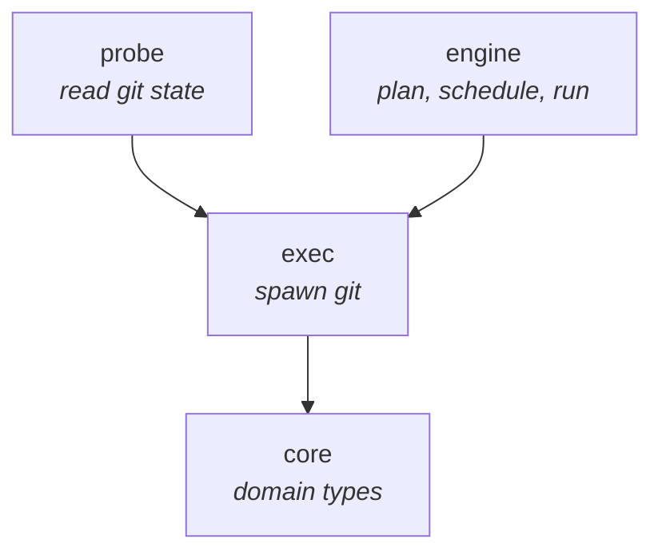
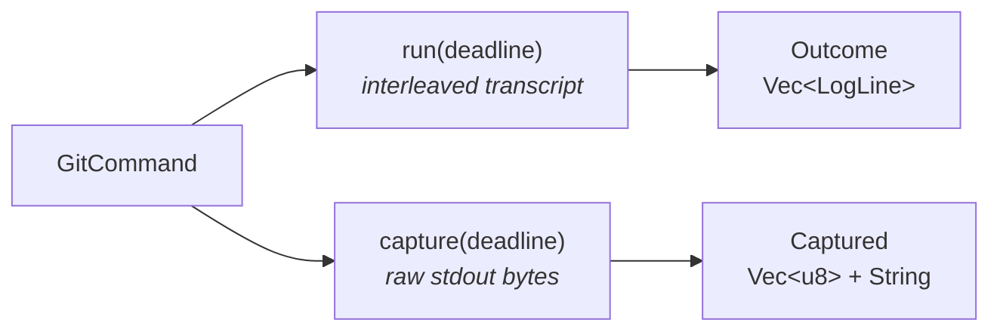
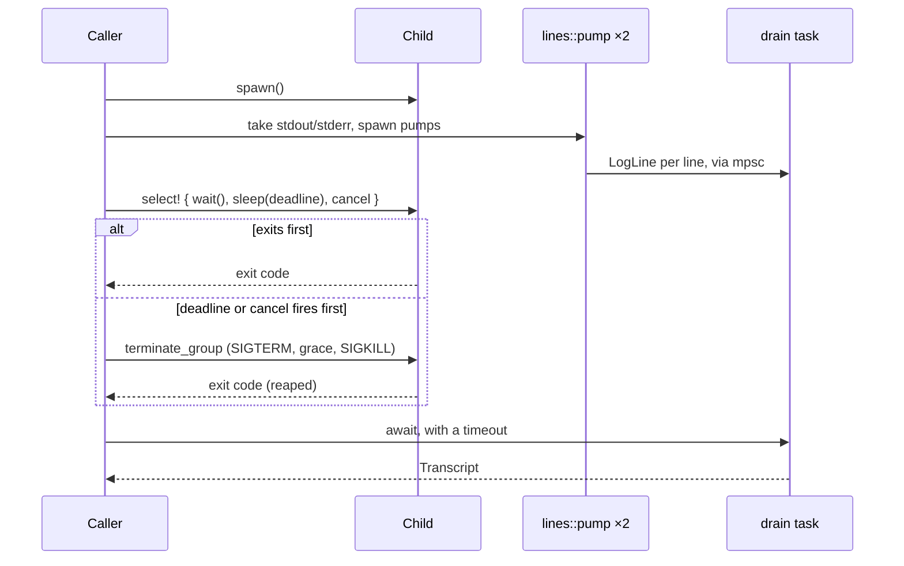
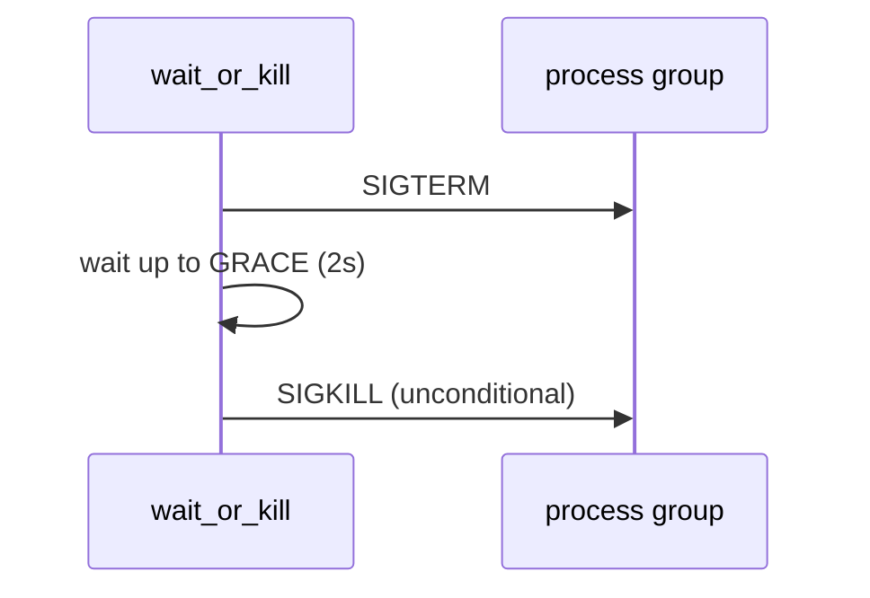
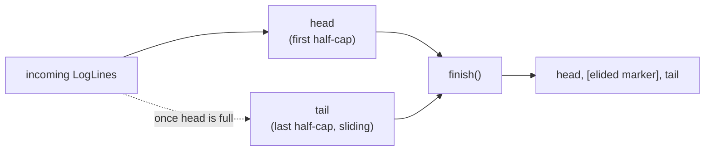

# `git-scylla-exec`

Runs `git` as a subprocess. A spawned `git` cannot prompt, cannot outlive its
deadline, and cannot deadlock the caller on its own output.

## Position in the workspace



`exec` depends only on `core`, for `LogLine` and `Stream`. `probe` uses it to
run read-only status commands; `engine`'s job runner uses it to run mutating
ones. Both callers get the same guarantees from the same spawn path.

## The three guarantees

| Guarantee | Mechanism |
| --- | --- |
| Cannot prompt | A hardened environment plus `/dev/null` on stdin |
| Cannot outlive its deadline | Its own process group; a timeout or cancellation kills the group |
| Cannot deadlock on its own output | Both pipes are drained concurrently with the wait, never after it |

Each has a test. [`env.rs`](../src/env.rs) asserts the full constructed
environment. [`kill.rs`](../src/kill.rs) and
[`tests/discipline.rs`](../tests/discipline.rs) exercise real signals against a
`git` that refuses to stop. [`GitCommand::run`](../src/lib.rs) is structured so
the pipes are taken before anything awaits `wait()`.

## `GitCommand`

A builder: `dir`, `args`, extra env, an optional `CancellationToken`, a
transcript byte cap. Two terminal methods, differing only in output policy:



`run` produces an `Outcome`: stdout and stderr interleaved in read order,
decoded lossily, one `LogLine` per line — what a job transcript is made of.

`capture` produces a `Captured`: stdout as raw bytes, stderr as text. `git
status -z` writes NUL-separated paths that need not be UTF-8; decoding them
into a transcript would corrupt the data the probe is trying to parse.

Same spawn, same environment, same process group, same deadline. Only what
happens to the output differs.

## Spawning

```rust,ignore
Command::new("git")
    .stdin(Stdio::null())
    .stdout(Stdio::piped())
    .stderr(Stdio::piped())
    .process_group(0)   // pgid == pid
    .kill_on_drop(true)
```

`process_group(0)` calls `setpgid(0, 0)`, so the child's process group id
equals its own pid. Everything the child spawns — `ssh`, a credential helper,
a hook — inherits that group. A deadline signals the group, not the pid.

Extra env from the builder is applied first, [`env::harden`](../src/env.rs)
last, so nothing a caller sets can turn off the hardening.

## Running: `run_or_kill` and drain



The pipes are taken and their pump tasks spawned before anything awaits the
child. A `select!` races `child.wait()` against the deadline and an optional
`CancellationToken`. `Child::wait` is cancel-safe, so losing that race and
calling it again after killing the group is sound.

`DRAIN_TIMEOUT` bounds the wait for the drain task after the group is dead.
With no process left to hold the write end, the read side should already be
closed; the timeout only prevents a stuck drain from hanging the caller.

## Killing a process group



`SIGTERM` goes to the group first, and a `git fetch` that catches it exits
before `GRACE` elapses. `SIGKILL` follows regardless of whether that
happened — a child dying promptly on `SIGTERM` says nothing about its own
children, and a grandchild that ignores `SIGTERM` is what the group signal
exists for. `SIGKILL` to an already-empty group returns `ESRCH`, which is not
logged as an error.

The negative pid (`kill(-pgid, sig)`) is what makes this a group signal
rather than a single-process one. `signal_group` refuses a non-positive
`pgid` outright, since `kill(-0, …)` would reach every process in the
caller's own group.

## Line splitting

[`lines::pump`](../src/lines.rs) turns one pipe into a stream of `LogLine`s.

- Splits on `\n` **or** `\r`. `git fetch`/`git push` write progress with
  carriage returns; a `\n`-only splitter would buffer an entire transfer into
  one line.
- Empty lines are dropped, so `\r\n` yields one line.
- A run longer than `MAX_LINE` (64 KiB) with no terminator is flushed anyway.
- Decoding is lossy UTF-8, per line, at the point of emission.
- A final unterminated line is still emitted — for `git`, often the `fatal:`
  that explains the failure.

## Transcript capping

[`Transcript`](../src/transcript.rs) is a capped, order-preserving
accumulator with head/tail retention: `DEFAULT_TRANSCRIPT_CAP` (4 MiB) split
in half between the two ends.



The head closes permanently the first time a line overflows into the tail —
never reopens for a later line that happens to be small enough to fit. Without
that, a long line could overflow to the tail while a short one after it lands
back in the head, ahead of the line it followed. `finish` concatenates head
then tail, so a reopened head would put lines out of order.

Elided lines are counted, not silently dropped: `finish` inserts a
`Stream::Notice` line stating how many lines and bytes were cut, timestamped
at the resume point so the transcript stays monotonic top to bottom.

## Error handling

`ExecError` has two variants: `Spawn` (`git` could not be started — not on
`PATH`, or the directory is gone) and `NoPid` (the child has no process id to
read a group from). Both are distinct from a `git` that ran and exited
non-zero, which is `Outcome`/`Captured` with a `code`, not an `Err`.

`Stop` records why a child stopped: `Exited`, `TimedOut`, or `Cancelled`. A
`timed_out: bool` cannot also say "cancelled"; `Stop` can, and the two states
carry different words to the UI.
