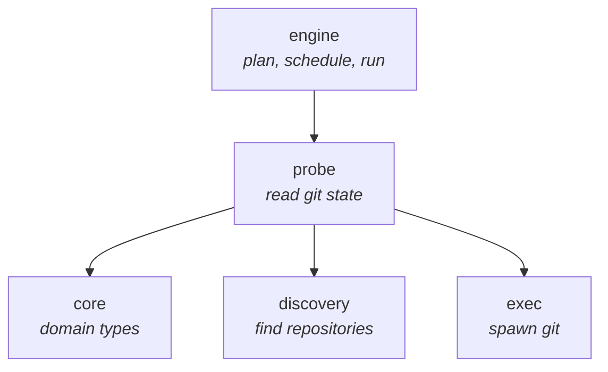
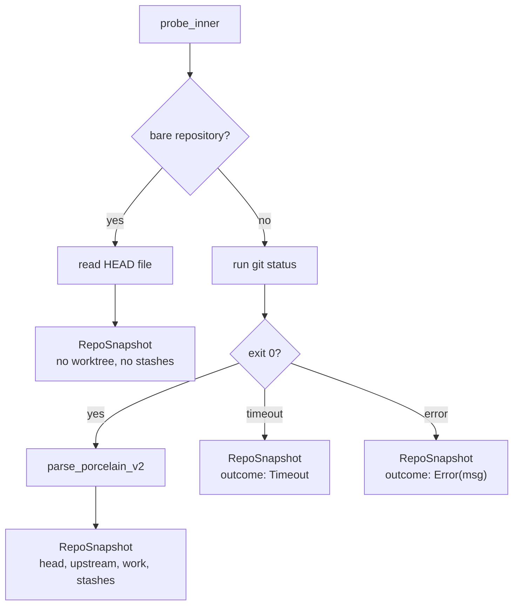
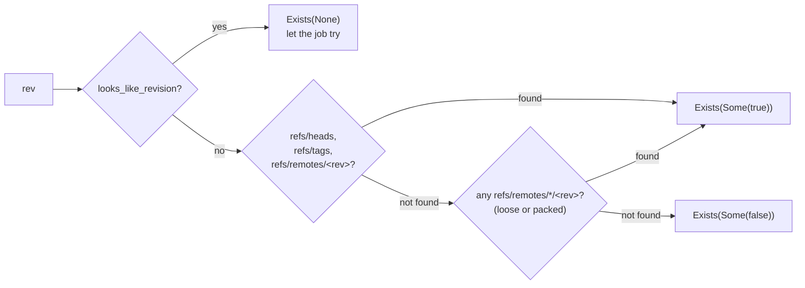
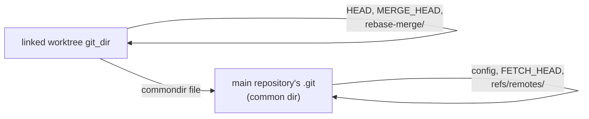

# `git-scylla-probe`

Turns a discovered repository into a [`RepoSnapshot`](../../core/src/snapshot.rs).
One `git status` invocation plus a handful of file reads, per repository.

## Position in the workspace



`engine` holds an `Arc<dyn Probe>` and never touches the filesystem or spawns
`git` itself. Every fact the engine has about a repository's state came
through this trait.

## The `Probe` trait

```rust,ignore
trait Probe: Send + Sync {
    fn probe(&self, req: ProbeRequest) -> BoxFuture<RepoSnapshot>;
    fn refs(&self, repos: Vec<RefRequest>, query: RefQuery) -> BoxFuture<Vec<Result<RefAnswer, RefError>>>;
    fn detail(&self, req: ProbeRequest) -> BoxFuture<Result<RepoDetail, DetailError>>; // unimplemented
}
```

Boxed futures rather than `async fn`, so the trait stays object-safe and the
engine can hold `Arc<dyn Probe>`.

`GitCliProbe` is the only production implementation. `FakeProbe`, behind the
`testkit` feature, answers from data written into a test rather than a real
`.git` directory.

### `probe`: one snapshot per repository

Infallible by construction. A timeout, a non-zero exit, or a missing `git`
binary all produce a `RepoSnapshot` carrying a `ProbeOutcome` other than `Ok`,
never an `Err`. A caller cannot drop a repository by ignoring an error, and a
failed probe can never render as clean.



A bare repository has no worktree, so `git status` is skipped rather than run
and discarded — in a bare repository the command fails outright, and a
failure the probe induced itself must not present as a broken repository.

### `refs`: one question, many repositories

```rust,ignore
enum RefQuery { DefaultBranch, Tags, Exists { rev: String } }
enum RefAnswer { DefaultBranch(Option<String>), Tags(Vec<String>), Exists(Option<bool>) }
```

One query per call, not one per repository — the question comes from the
action a user chose once; a plan asks it of every repository in the working
set. All requests in a batch run on one `spawn_blocking`, since every read
here is `std::fs`: walking `refs/` for a hundred repositories on the calling
task would pin a runtime worker for the duration.

| Query | Answer | `None`/absence means |
| --- | --- | --- |
| `DefaultBranch` | `Option<String>` | no `origin/HEAD` and no `main`/`master` fallback |
| `Tags` | `Vec<String>` | no tags |
| `Exists { rev }` | `Option<bool>` | `rev` carries revision syntax (`main~3`, an object id) and cannot be answered from the filesystem |

`RefError` is separate from a `None`/`false` answer: it means the repository
itself could not be read, not that the question resolved to "no".



The DWIM branch exists because `git checkout main` with no local `main`
creates one tracking `origin/main`; a caller asking about `main` means that
case too.

## Reading `git status`

[`porcelain.rs`](../src/porcelain.rs) parses the stdout of:

```
git --no-optional-locks status --porcelain=v2 --branch --show-stash -z -unormal
```

`--no-optional-locks` is mandatory: without it, `git status` refreshes the
index and takes `index.lock`, contending with the user's own git commands.

The parser is positional and byte-oriented, never regex-based, driven by two
properties of the format:

- **Records are NUL-separated, not newline-separated.** Paths may contain
  newlines.
- **A rename entry occupies two records** — the new path, then the old one.
  The parser must consume both or misread everything after the first rename.

Paths are counted, never decoded to `String`; a repository with non-UTF-8
filenames must parse without erroring.

Unrecognised or malformed records are ignored rather than rejected, so a
future git version adding a header, or one malformed line, does not turn a
whole repository into a failure.

## Facts outside `git status`

[`gitdir.rs`](../src/gitdir.rs) reads marker files directly, no subprocess.

**Common dir resolution.** A linked worktree's git dir contains a `commondir`
file pointing at the main repository's `.git`. Some state is per-worktree,
some is shared:

| Per-worktree (`git_dir`) | Shared (common dir) |
| --- | --- |
| `HEAD` | `config` |
| `MERGE_HEAD`, `rebase-merge/` | `FETCH_HEAD` |
| — | `refs/remotes/` |



**In-progress operations.** `detect_in_progress` checks marker files in a
fixed order — `rebase-merge`/`rebase-apply`, `MERGE_HEAD`,
`CHERRY_PICK_HEAD`, `REVERT_HEAD`, `BISECT_LOG` — so a repository carrying
more than one marker reports the most obstructive one deterministically.

**Last fetch.** `FETCH_HEAD`'s mtime is the primary signal; it moves for a
fetch by anyone, including the user's own terminal. A repository cloned but
never fetched since has no `FETCH_HEAD` at all, so the fallback is the newest
mtime among `refs/remotes/*` entries.

## Remotes and hosts

[`config.rs`](../src/config.rs) reads `[remote "name"] url = ...` stanzas
directly out of the git config file — a minimal INI reader, not `git remote
-v` — since a second subprocess per repository would double the cost of a
scan to answer a question this cheap. Two consequences:

- `url.<base>.insteadOf` rewrites are not applied; a rewritten URL buckets
  under the host it is literally written as.
- `[include]`/`[includeIf]` directives are not followed; a remote defined
  only in an included file is invisible.

The host extracted from a remote URL is a concurrency-bucket key for
automatic fetching, not a correctness-critical value — a miss costs
throughput, nothing else. `host_of_url` handles the three forms git accepts:
a URL with a scheme, the `scp`-like `[user@]host:path`, and a local path
(which has no host at all).

## Testing without a filesystem

[`fake.rs`](../src/fake.rs), behind the `testkit` feature, implements `Probe`
from data written into the test itself:

```rust,ignore
FakeProbe::new()
    .with(FakeRepo::new(path).default_branch("master"))
    .with(FakeRepo::new(other_path))
```

This lives beside the trait it implements, not in `crates/testkit`: a change
to `Probe` then breaks in the same `cargo check` as the trait change, and
`testkit` — the specification the real probe is judged against — does not
depend on `git-scylla-probe`. Asking `FakeProbe` about an unregistered
repository panics rather than inventing a plausible clean row.

## Deliberately unexported

`default_branch`, `has_ref`, and `tags` are `pub(crate)`. They are how
`GitCliProbe` answers a `RefQuery` and nothing else; a caller that needs a ref
fact goes through `Probe::refs`, not around it.
