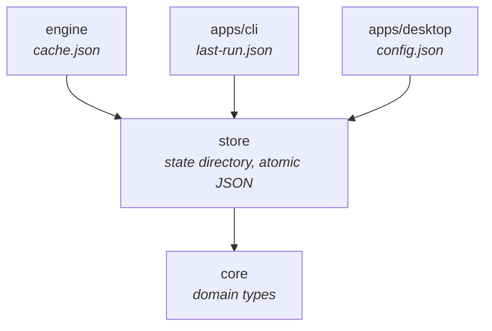
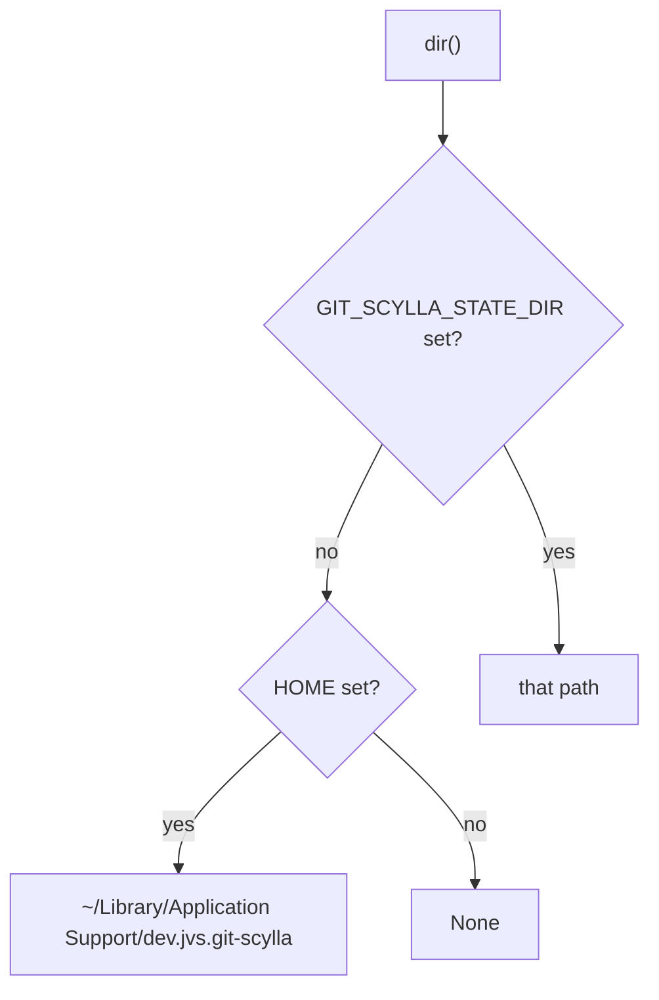
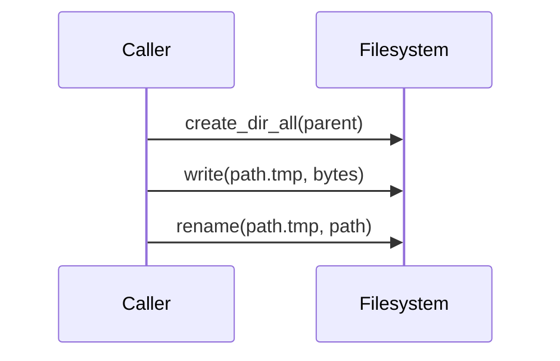
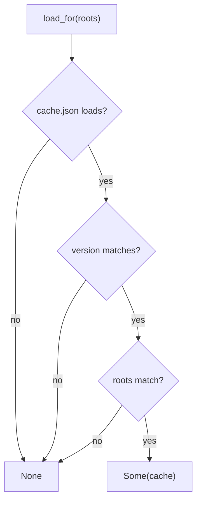

# `git-scylla-store`

Persists small pieces of state to disk: application configuration, the
startup cache, the CLI's last-run transcript.

## Position in the workspace



`store` depends only on `core`, for `RepoSnapshot` and `serde_time`. It has
no knowledge of `engine`, the CLI, or the desktop app; each consumer owns the
shape of its own file and calls into `store` only for the directory and the
write.

## State directory

`dir()` resolves one directory for every consumer:



A single environment variable governs every file this crate writes. `None`
means there is nowhere to put anything; callers treat that as "state is
unavailable" rather than as an error.

`path(name)` joins `dir()` with a filename.

## Atomic writes

`write_atomic` writes to a temporary file in the target directory, then
renames it over the target:



The temporary lives in the same directory as the target, so the rename is a
single filesystem operation. A process that dies mid-write leaves the
temporary file, never a truncated target.

## JSON helpers

`save_json` serializes a value with `serde_json::to_vec_pretty` and calls
`write_atomic`. `load_json` reads a file and deserializes it.

`load_json` returns `Option`, never `Result`. A missing file, an unreadable
file, and malformed JSON all produce `None`; a parse failure additionally
logs a `tracing::warn!`. No caller in this workspace branches on which of
the three occurred.

## `StoreError`

Three variants, surfaced only from the write path:

| Variant | Meaning |
| --- | --- |
| `NoDirectory` | `dir()` returned `None` |
| `Io` | a filesystem call failed, with the path and the underlying error |
| `Encode` | `serde_json` failed to serialize the value |

## `Cache`

The startup cache: a snapshot of repository state from the previous run, so
a launch has rows to show before its own scan completes.

```rust,ignore
pub struct Cache {
    pub version: u32,
    pub written_at: SystemTime,
    pub roots: Vec<PathBuf>,
    pub repos: Vec<RepoSnapshot>,
}
```

One JSON file, `cache.json`, rewritten in full on every save.

`Cache::load_for(roots)` returns `Some` only when a cache exists, its
`version` matches `CACHE_VERSION`, and its `roots` equal the roots passed
in:



A version mismatch discards the cache outright; there is no migration
path. A root-set mismatch discards it too — a cache written for a
different set of roots holds rows for repositories outside the current
working set.

## Consumers

| Consumer | File | Contents |
| --- | --- | --- |
| `engine` | `cache.json` | `Cache` — repository snapshots from the last scan |
| `apps/cli` | `last-run.json` | `LastRun` — the jobs from the last batch, overwritten each run |
| `apps/desktop` | `config.json` | `Config` — roots, filters, and other persisted settings |

Each consumer defines its own struct and its own filename constant; `store`
supplies only `path`, `dir`, `write_atomic`, `save_json`, and `load_json`.
