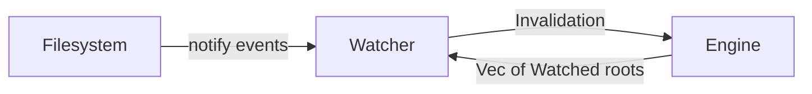
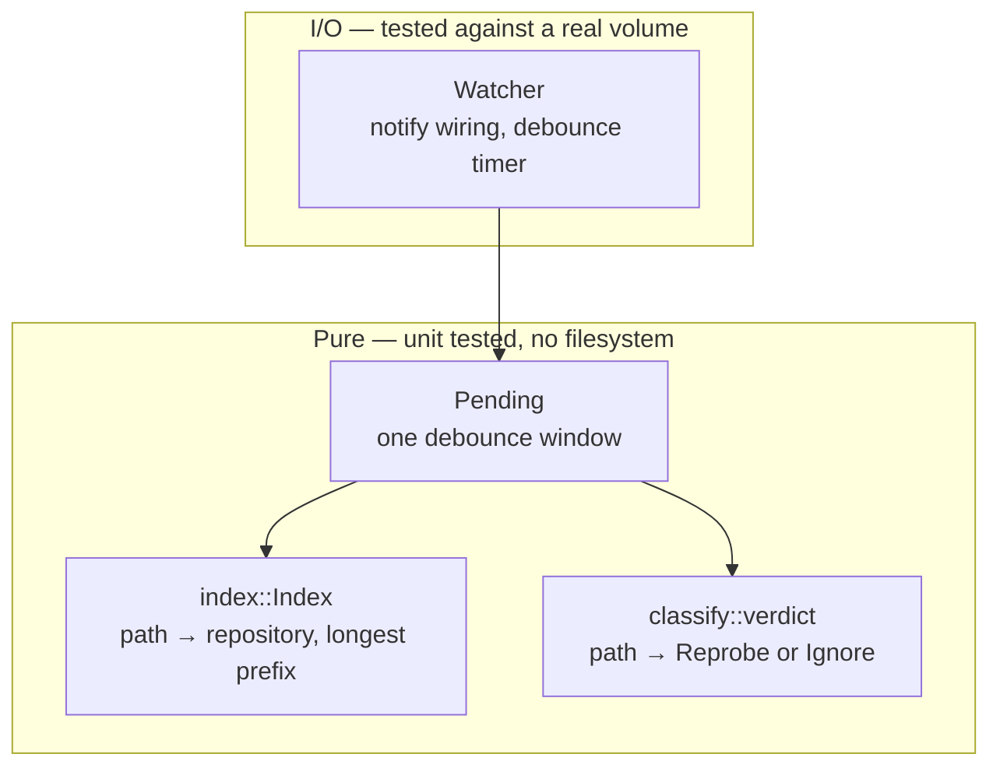
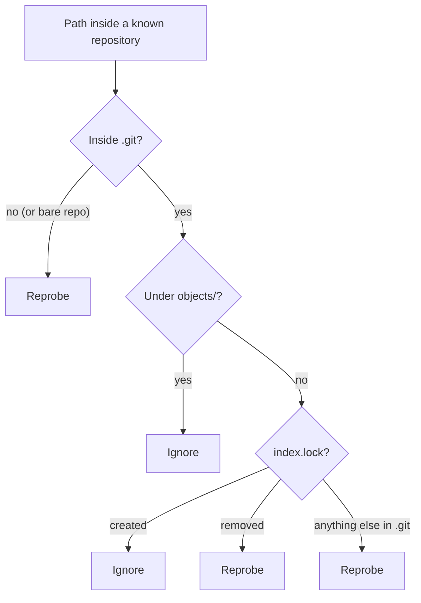
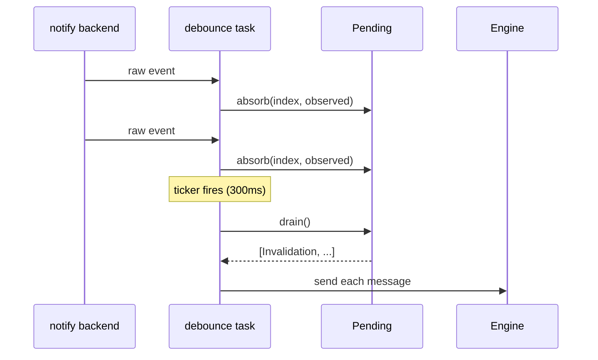

# watch

Turns filesystem events into repository invalidations for the engine.

## Purpose

The watcher answers one question: which repository moved. It does not probe a
repository, read a snapshot, or decide whether a re-probe is currently
allowed. The engine owns all three.

The engine supplies the watcher's index (`Watched` roots). The watcher
supplies `Invalidation` messages. Nothing else crosses the boundary.

## Layers

### `index::Index`

Maps a changed path to the repository that owns it. This is a prefix
question: is any ancestor of this path a repository. Entries are a sorted
`Vec`, searched by binary search. A `HashMap` answers whether a path itself is
a repository; it cannot answer whether an ancestor is.

Repositories nest — a submodule, a linked worktree, a checkout under a vendor
directory. The longest matching prefix wins.

The index is rebuilt from scratch on every scan (`Index::new`), never mutated
in place.

### `classify::verdict`

Given a path already known to belong to a repository, decides `Reprobe` or
`Ignore`.

- Outside `.git` — or anywhere in a bare repository — is `Reprobe`. `git
  status` output depends on the whole worktree; only git can say whether a
  change is significant.
- `.git/objects/**` is `Ignore`. A fetch or `gc` writes thousands of loose
  objects. None is reachable until a ref points at it, and the ref write is a
  separate, reported event.
- `.git/index.lock` being created is `Ignore`; its removal is `Reprobe`.
  Creation marks an operation starting. Probing then reads a torn state.
- Everything else inside `.git` — `HEAD`, `refs/**`, `index`, `packed-refs`,
  `FETCH_HEAD`, `MERGE_HEAD`, `rebase-merge/**` — is `Reprobe`.

### `Pending`

Accumulates one debounce window into a small set of `Invalidation` messages.

| field | type | meaning |
|---|---|---|
| `repos` | `BTreeSet<RepoId>` | repositories to reprobe |
| `discover` | `BTreeSet<PathBuf>` | a `.git` appeared with no known owner |
| `gone` | `BTreeSet<RepoId>` | repositories no longer on disk |
| `rescan` | `bool` | the backend lost history; everything else is void |

A set collapses forty events touching one repository into one entry.

`drain()` orders its output `Gone`, then `Discover`, then `Repos`. The engine
drops a repository before being asked to reprobe it.

## Disappearance

A removed path is checked before classification. What used to be inside it no
longer helps classify it.

Two shapes:

- A directory holding one or more checkouts is removed. Every repository at
  or below that path is gone (`Index::under`).
- A repository's `.git` is removed while its worktree directory remains. That
  repository is gone even though its path still exists.

Disappearance is decided by an `exists` check against the current path, not
by the event's reported kind. FSEvents commonly coalesces a removal into an
event carrying no kind at all.

## Debounce and reindexing

`Watcher::start` spawns a task that folds every raw `notify` event into
`Pending` and drains it on a fixed interval (`DEBOUNCE`, 300ms). One editor
save, or one `git commit`, touches several files inside a single window; the
window reports it as one message.

The watcher's index starts empty. Every event is unattributable until the
engine calls `reindex` after its first scan settles.

`IndexHandle` refills the index without requiring the caller to hold a lock
across an await point.

## Bare repositories

A bare repository's git directory is its root; there is no separate worktree.
Every path inside it goes through the same `.git`-relative rules classify
applies to a normal repository's `.git`.

`repository_appearing` does not detect a bare repository appearing — there is
no `.git` to spot. Recognizing one needs `HEAD` + `objects/` + `refs/`, which
only a directory walk can confirm.

## Errors

A `notify::Watcher` error, and a `need_rescan()` event, both become
`Invalidation::Rescan`, replacing the current window. The backend has
reported that it cannot say what changed. Nothing gathered before that point
is trustworthy either.

## Testing

`index`, `classify`, and `Pending` are pure and tested without a filesystem.
The `notify` wiring in `Watcher` is tested separately, in the `backend`
module, against a real temporary directory — the one layer a pure unit test
cannot reach.
